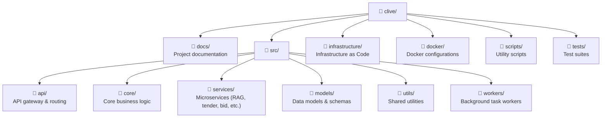

# CLIVE - Clearview's In House AI Platform

## Overview

CLIVE is a on-premises AI platform designed  for knowledge management, tender analysis, bid writing and document generation.

## Arhitecture Principles
 - **Open Source First**: Prefer open-source solutions for all infrastructure components
 - **Docker First**: All services containerized for consistency and reproductibility
 - **API First**: All functionality exposed through well-documented API
 - **Self Hosted**: Complete control over data and infrastructure
 - **Infrastructure as Code**: All infrastructure defined in version-controlled code
 - **Modular Design**: Loosely coupled services for maintainability and scaling

## Quick Start

*Documentation in progress - see /docs directory*

---

##Project Strucure

## License

Proprietary - CVC Internal Use Only
EOF

